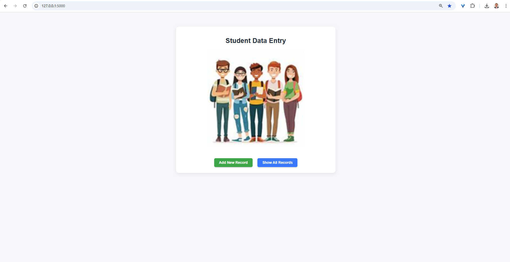
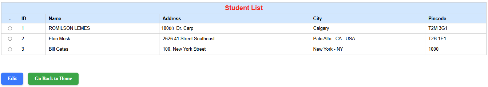

# 🤖 Project for testing the Flask framework with student data recording in an SQLite database

This project provides an interface for registering student data.
It includes three simple interfaces:

**1. Main page** that directs the user to the student registration section.

**2. Registration page** with a form to enter student information.

**3. Listing page** that displays all registered students and allows selecting a record to edit.

**4. Editing page** where student data can be updated.

All information is saved in the **database.db** file, which is managed by **SQLite**.

---

## 📋 Overview

---

## 🖼️ Application Preview

Below is a screenshot of the main interface and the other interface running locally:


## 👨‍🎓👩‍🎓 Student Data Entry Page
<p align="center">
  
</p>


## 🗂️ Student Records
<p align="center">
  
</p>


---

## 🧰 Technologies Used

| Category | Tools / Libraries |
|-----------|-------------------|
| **Flask Framework** | [Flask](https://flask-dev.readthedocs.io/en) |
| **Language** | Python **3.14.0** | [Python](https://www.python.org/)

---

## ⚙️ Installation

### 1. Create a new virtual environment

```bash
python -m venv .venv
```

### 2. Activate virtual environment - [Windows]
```
.venv\Scripts\activate.bat
```
### 3. Install libraries

```
pip install -r requirements.txt
```

